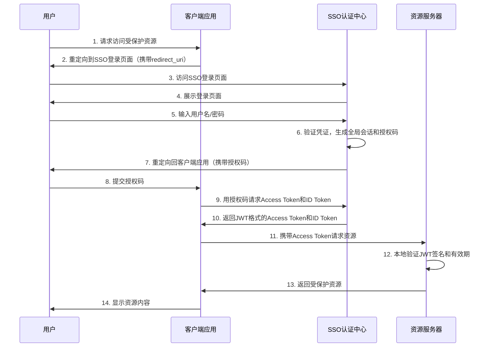
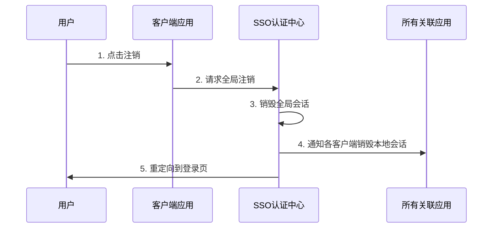
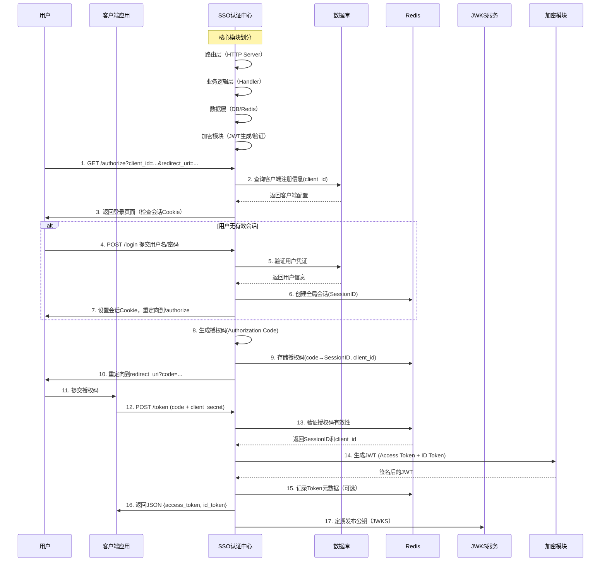

# 功能设计

---

## 目录

-   [关键组件说明](#关键组件说明)
-   [安全注意事项](#安全注意事项)
-   [SSO 单点登录流程图](#sso-单点登录流程图)
-   [注销流程](#注销流程)
-   [SSO 认证中心详细流程](#sso-认证中心详细流程)

---

### 关键组件说明

#### SSO 认证中心：

-   负责用户身份认证、会话管理、Token 颁发。

-   维护全局会话状态（如通过 Cookie 或分布式缓存）。

#### 客户端应用：

-   直接面向用户提供界面。
-   依赖 SSO 认证中心完成登录，不直接处理用户密码。

#### 资源服务器：

-   验证 Access Token 的合法性（如 JWT 签名、有效期）。
-   保存、处理和提供资源。

---

### 安全注意事项

-   Token 有效期：Access Token 应设置短有效期，使用 Refresh Token 续期。

-   HTTPS：所有通信需加密。

-   跨站防护：防范 CSRF 和 XSS 攻击（如 State 参数校验）。

---

### SSO 单点登录流程图

### 分步详细说明

#### 步骤 1-2：用户触发登录

1. 用户请求资源：用户尝试访问客户端应用中的受保护资源。

2. 重定向到 SSO：客户端检测用户未登录，直接重定向到 SSO 认证中心，并附带 redirect_uri（回调地址）。

#### 步骤 3-7：用户登录并获取授权码

3. 访问登录页面：用户被重定向到 SSO 认证中心的登录页面。

4. 展示登录页面：SSO 认证中心返回登录页面。

5. 用户输入凭证：用户输入用户名和密码。

6. 验证凭证：SSO 认证中心验证凭证，生成全局会话和授权码。

7. 重定向回客户端：SSO 认证中心将用户重定向回客户端应用的 redirect_uri，并附带授权码。

#### 步骤 8-10：客户端获取 Token

8. 提交授权码：客户端应用通过后端通道接收授权码。

9. 请求 Token：客户端应用向 SSO 认证中心发送授权码，请求 Access Token 和 ID Token。

10. 返回 JWT Token：SSO 认证中心验证授权码后，返回 JWT 格式的 Access Token（签名）和 ID Token。

#### 步骤 11-14：访问资源

11. 携带 Token 请求资源：客户端应用在请求头中携带 Access Token（如 Authorization: Bearer <token>）。

12. 本地验证 JWT：资源服务器自行验证 JWT 的签名（使用预置公钥或动态获取 JWKS）和有效期（检查 exp 字段）。

13. 返回资源：验证通过后，资源服务器返回受保护数据。

14. 展示内容：客户端应用将资源展示给用户。

---

### 注销流程

---

### SSO 认证中心详细流程

