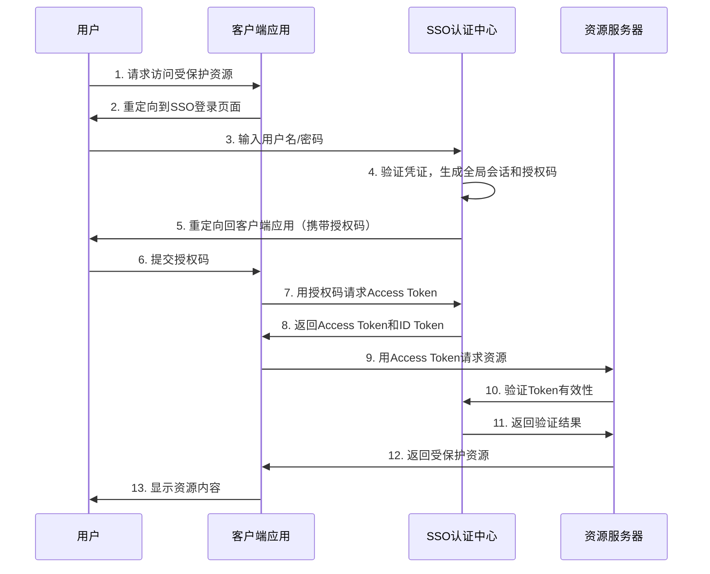
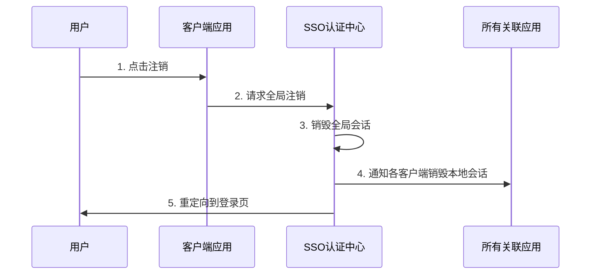

# 功能设计

---

## 目录

-   [关键组件说明](#关键组件说明)
-   [SSO 单点登录流程图](#sso-单点登录流程图)
-   [SSO 单点登录流程图分步详细说明](#sso-单点登录流程图分步详细说明)
-   [注销流程](#注销流程)
-   [安全注意事项](#安全注意事项)

---

### 关键组件说明

#### SSO 认证中心：

-   负责用户身份认证、会话管理、Token 颁发。

-   维护全局会话状态（如通过 Cookie 或分布式缓存）。

#### 客户端应用：

-   直接面向用户提供界面。
-   依赖 SSO 认证中心完成登录，不直接处理用户密码。

#### 资源服务器：

-   验证 Access Token 的合法性（如 JWT 签名、有效期）。
-   保存、处理和提供资源。

---

### SSO 单点登录流程图

---

### SSO 单点登录流程图分步详细说明

#### 1. 用户请求访问客户端应用

用户尝试访问需要登录的客户端应用（如 app.example.com）。

#### 2. 重定向到 SSO 登录页

客户端检测用户未登录，将其重定向到 SSO 认证中心（如 sso.example.com），并附带回调地址（redirect_uri）。

#### 3. 用户输入凭证

用户在 SSO 认证中心的登录页面输入用户名和密码。

#### 4. 认证中心验证凭证

SSO 认证中心验证用户凭证：

-   若首次登录，创建全局会话（Global Session）并生成短期有效的 授权码（Authorization Code）。

-   若已登录（存在全局会话），跳过凭证验证，直接生成授权码。

#### 5. 重定向回客户端应用

SSO 认证中心将用户重定向回客户端应用的回调地址（redirect_uri），并附带授权码。

#### 6. 客户端提交授权码

客户端应用通过后端通道将授权码发送到 SSO 认证中心（避免前端暴露敏感信息）。

#### 7. 请求 Access Token

客户端应用向 SSO 认证中心请求 Access Token 和 ID Token，需提供：

-   授权码

-   客户端 ID 和密钥（用于身份验证）

#### 8. 返回 Token

SSO 认证中心验证授权码和客户端身份后，返回：

-   Access Token：用于访问资源服务器。

-   ID Token（JWT 格式）：包含用户身份信息（如用户 ID、邮箱）。

#### 9. 访问资源服务器

客户端应用使用 Access Token 向资源服务器（如 API 服务）请求受保护资源。

#### 10-11. 验证 Token 有效性

资源服务器向 SSO 认证中心验证 Access Token 的有效性（或通过 JWT 签名自验证）。

#### 12-13. 返回资源

验证通过后，资源服务器返回数据，客户端应用展示内容给用户。

---

### 注销流程

---

### 安全注意事项

-   Token 有效期：Access Token 应设置短有效期，使用 Refresh Token 续期。

-   HTTPS：所有通信需加密。

-   跨站防护：防范 CSRF 和 XSS 攻击（如 State 参数校验）。
