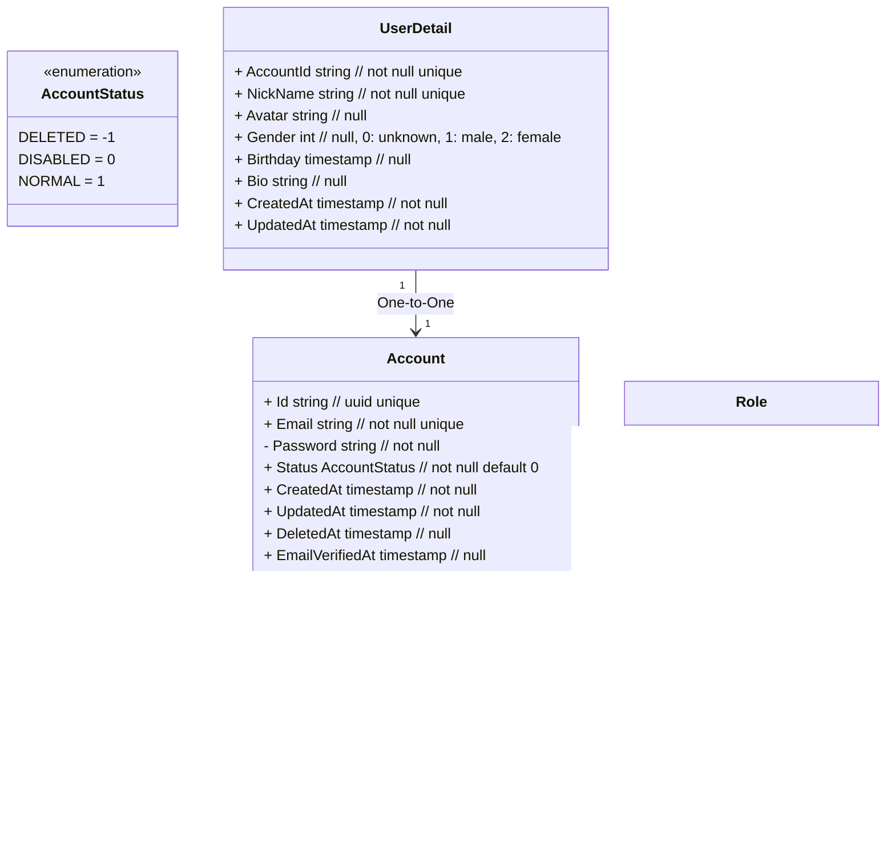

# 帐户模型

```mermaid
classDiagram
    class Account {
        + Id string // uuid unique
        + Email string // not null unique
        - Password string // not null
        + Status AccountStatus // not null default 0
        + CreatedAt timestamp // not null
        + UpdatedAt timestamp // not null
        + DeletedAt timestamp // null
        + EmailVerifiedAt timestamp // null
        + LastLoginAt timestamp // null
    }
    class AccountStatus{
        <<enumeration>>
        DELETED = -1
        DISABLED = 0
        NORMAL = 1
    }
    class UserDetail {
        + AccountId string // not null unique
        + NickName string // not null unique
        + Avatar string // null
        + Gender int // null, 0: unknown, 1: male, 2: female
        + Birthday timestamp // null
        + Bio string // null
        + CreatedAt timestamp // not null
        + UpdatedAt timestamp // not null
    }
    class Role {
        + Id string // uuid unique
        + Name string // not null unique
        + Description string // null
        + CreatedAt timestamp // not null
        + UpdatedAt timestamp // not null
    }
    class AccountRole {
        + AccountId string // not null
        + RoleId string // not null
        + CreatedAt timestamp // not null
    }

    UserDetail "1" --> "1" Account : One-to-One
    Account "1" --> "*" AccountRole : One-to-Many
    Role "1" --> "*" AccountRole : One-to-Many
```
