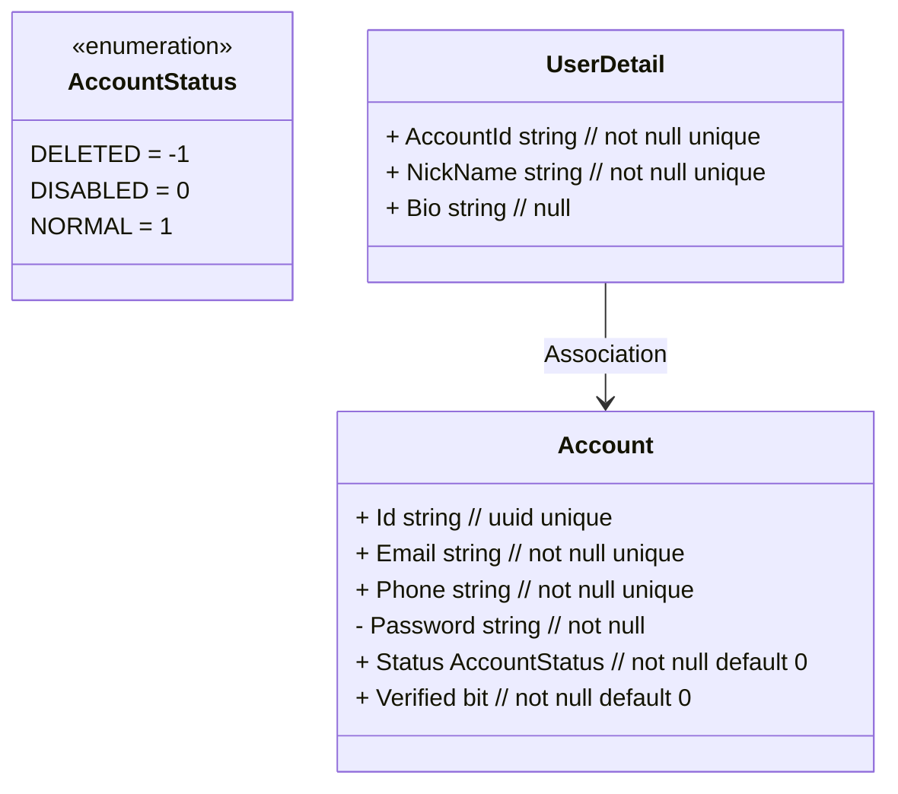

# 帐户模型

```mermaid
classDiagram
    class Account {
        + Id string // uuid unique
        + Email string // not null unique
        + Phone string // not null unique
        - Password string // not null
        + Status AccountStatus // not null default 0
        + Verified bit // not null default 0
    }
    class AccountStatus{
        <<enumeration>>
        DELETED = -1
        DISABLED = 0
        NORMAL = 1
    }
    class UserDetail {
        + AccountId string // not null unique
        + NickName string // not null unique
        + Bio string // null
    }

    UserDetail --> Account : Association

```
