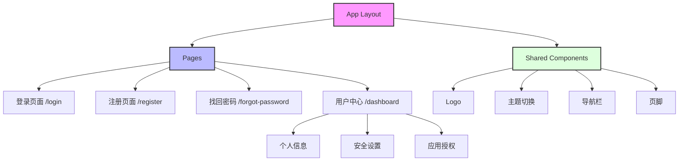

# SSO 前端系统

## 项目简介

这是一个基于 [Next.js](https://nextjs.org) 构建的单点登录（SSO）系统前端项目，使用 [`create-next-app`](https://nextjs.org/docs/app/api-reference/cli/create-next-app) 引导创建。

### 技术栈

-   **框架**: Next.js 14
-   **UI 组件**: Shadcn/ui
-   **样式方案**: Tailwind CSS
-   **字体优化**: next/font，使用 [Geist](https://vercel.com/font) 字体
-   **开发语言**: TypeScript

### 主要特性

-   🎨 现代化的 UI 设计
-   🌓 支持深色/浅色主题切换
-   📱 响应式布局，支持多端适配
-   🔐 完整的用户认证流程
-   🚀 基于 Next.js 的高性能架构

## 功能模块

### 页面架构



### 核心功能

-   **用户认证**：支持账号密码登录、第三方登录
-   **用户注册**：提供完整的注册流程和表单验证
-   **密码找回**：支持邮箱验证的密码重置流程
-   **个人中心**：用户信息管理、安全设置、应用授权管理

## 开发指南

### 环境准备

确保你的开发环境中已安装：

-   Node.js 18.0.0 或更高版本
-   npm、yarn 或 pnpm 包管理器

### 开始开发

1. 克隆项目并安装依赖：

```bash
git clone <repository-url>
cd frontend/react
pnpm install  # 或 npm install、yarn
```

2. 启动开发服务器：

```bash
pnpm dev  # 或 npm run dev、yarn dev
```

访问 [http://localhost:3000](http://localhost:3000) 查看应用。

### 项目结构

-   `/app` - 页面和路由
-   `/components` - 可复用的 UI 组件
-   `/lib` - 工具函数和配置
-   `/public` - 静态资源

## 许可证

MIT License

Copyright (c) 2024 SSO System

Permission is hereby granted, free of charge, to any person obtaining a copy
of this software and associated documentation files (the "Software"), to deal
in the Software without restriction, including without limitation the rights
to use, copy, modify, merge, publish, distribute, sublicense, and/or sell
copies of the Software, and to permit persons to whom the Software is
furnished to do so, subject to the following conditions:

The above copyright notice and this permission notice shall be included in all
copies or substantial portions of the Software.

THE SOFTWARE IS PROVIDED "AS IS", WITHOUT WARRANTY OF ANY KIND, EXPRESS OR
IMPLIED, INCLUDING BUT NOT LIMITED TO THE WARRANTIES OF MERCHANTABILITY,
FITNESS FOR A PARTICULAR PURPOSE AND NONINFRINGEMENT. IN NO EVENT SHALL THE
AUTHORS OR COPYRIGHT HOLDERS BE LIABLE FOR ANY CLAIM, DAMAGES OR OTHER
LIABILITY, WHETHER IN AN ACTION OF CONTRACT, TORT OR OTHERWISE, ARISING FROM,
OUT OF OR IN CONNECTION WITH THE SOFTWARE OR THE USE OR OTHER DEALINGS IN THE
SOFTWARE.
